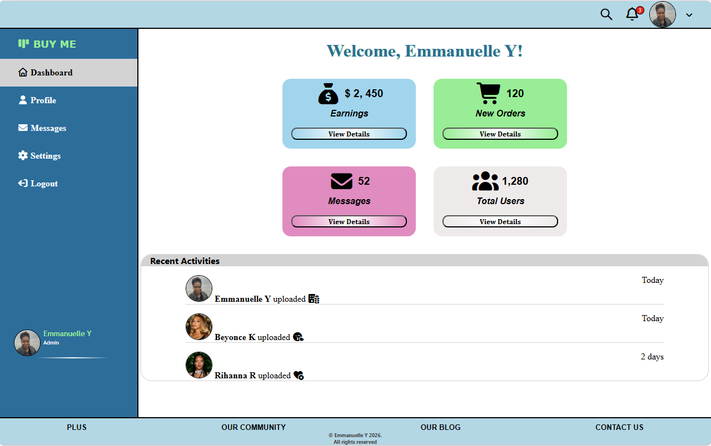

# My Dashboard

## Description

This small project guides you through building a simple dashboard using HTML and CSS. The main objective is to explore modern CSS techniques such as Flexbox, Grid, object-fit for images, positioning (absolute and relative), styling navigation links and much more — to create a fully responsive layout. The result is a clean, well-structured web page that looks great on any screen size.

This project if perfect for beginners.

Here's what the dasboard looks like:  

## Installation
The good thing with this project is that it's simple to run in your local environment. All you need is a web browser. Let me guide you through the "installation" process.

1. Clone this repository
2. Go to the project folder and open the dashboard.html file with your favorite browser.
3. Voilà! The web page is displayed in your web browser.

<b>Don’t hesitate to resize the viewport to see how the web page adapts to different screen sizes</b>

<b>PS: </b> I do not own the rights to some of the images included in the images folder.

## Customization
his is the fun part! The stage is yours. Let’s see what you can create. Experiment with the HTML elements and CSS styles: change the colors, add more divs, include a video, or even incorporate some JavaScript to make it more dynamic. The best way to learn is by doing, so don’t hold yourself back.

Hope this little project will be as fun to you as it was to me.
